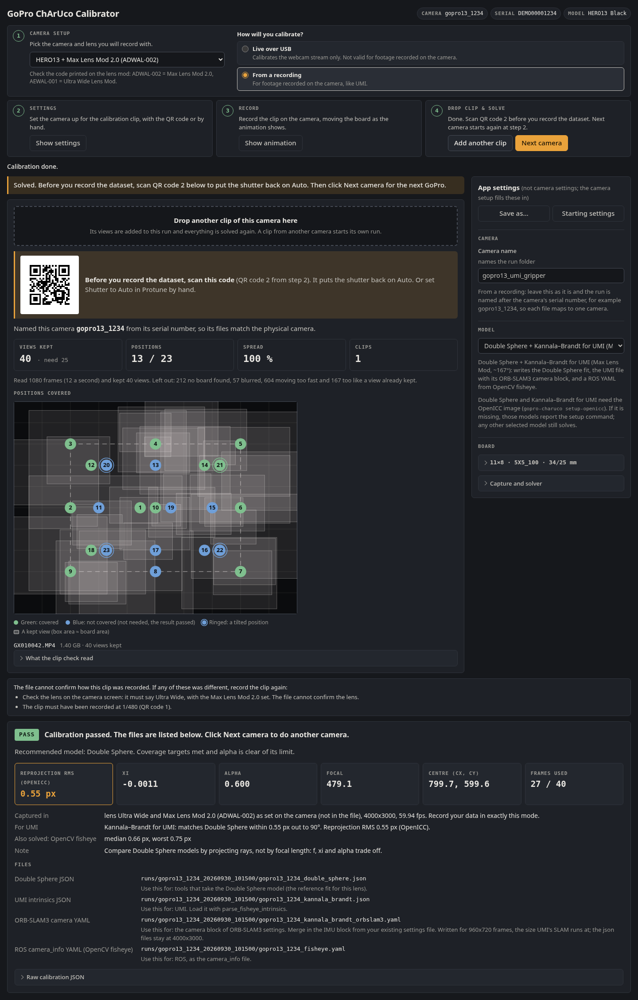

# GoPro ChArUco Calibrator

Calibrate GoPro lenses for robotics, including the ~167° Max Lens Mod fisheye, from the live
USB webcam stream, using a calib.io ChArUco board. It runs in your browser, needs no ROS, and
works one camera after another.



<sub>A solved run on a simulated HERO13 + Max Lens Mod 2.0 feed. The frames are rendered by
[`scripts/screenshot.py`](scripts/screenshot.py); the detection, solve and UI are the app's own.</sub>

## Why

Wide GoPro lenses break the usual calibration recipe. A pinhole model can't fit Wide. OpenCV's
fisheye model only looks good on the Max Lens Mod because it keeps the centre views and drops the
edge ones. SuperView cannot be fitted by any model at all.
This tool:
- **picks a model that fits your lens.** It solves the Max Lens Mod with Double Sphere through
  OpenICC, and also writes a Kannala–Brandt file that UMI can load;
- **reads back what the camera actually applied**, because the lens you request is not always
  the lens you get;
- **shows where the board has been**, so you know the edges of the image are covered.

The hard-won details are in [docs/](docs/README.md).

## Quick start

You need [uv](https://docs.astral.sh/uv/) and `ffmpeg` (`sudo apt install ffmpeg` or
`sudo pacman -S ffmpeg`).

```bash
git clone https://github.com/GrgaPalcic/gopro-charuco-calibrator.git
cd gopro-charuco-calibrator
uv run gopro-charuco serve --config gopro_charuco_calibrator/presets/gopro13_wide_1080p.yaml
```

Open http://localhost:8765. The first `uv run` fetches Python 3.12 and every dependency. Nothing
needs `sudo`, except possibly a one-time [firewall rule](#firewall).

Calibrating a Max Lens Mod for UMI? Do step 1 of
[that section](#hero13-with-the-max-lens-mod-20) (`setup-openicc`) first.

Then work through the four steps across the top. The amber button is always the next thing to
click, and a greyed-out button tells you why when you hover over it.

1. **Camera setup.** Pick the camera and lens you will record with, for example
   "HERO13 + Max Lens Mod 2.0 (UMI gripper)". The settings on the right fill in at once.
2. **Connect.** Plug the GoPro in over USB, switch it on and click **Open preview**. The dot at the
   top turns green when frames arrive, and the chips at the top right show the lens and lens mod
   the camera reports. **Stop** ends the webcam stream.
3. **Capture.** Click **Start new run**, then hold the board where the orange box is, matching its
   size and tilt. Views save automatically when the board matches; **Capture now** saves the
   current view straight away. **Pause** stops saving views while the preview keeps running.
4. **Solve.** This runs on its own when the guide is done, or click **Solve** once there are
   enough views. The result names the recommended model and lists the files it wrote, with what
   each one is for. Its badge says:
   - **PASS:** the coverage targets are met and the recommended model looks sound;
   - **RETAKE:** click **Resume**, add the views it asks for, and solve again;
   - **INCOMPLETE:** Double Sphere or the UMI file (Kannala–Brandt) did not solve, for example
     because the OpenICC image is not built; the result says how to fix it;
   - **FAILED:** no model solved; the reasons are listed.

For the next camera, click **Next camera** in step 4. It ends the run. Plug in the next GoPro, give
it its own **Camera name** in Settings (it names the files), and click **Open preview**.

## HERO13 with the Max Lens Mod 2.0

Calibrate the camera exactly as your data is recorded. For the UMI-style gripper cameras that is:
mod fitted, USB webcam Wide, 1080p.

1. **Once per machine,** build the OpenICC backend, which solves both Double Sphere and the
   Kannala–Brandt file for UMI. You need Docker, usable without sudo; the build takes about
   10 minutes and no GPU:
   ```bash
   uv run gopro-charuco setup-openicc
   ```
   This builds the image `gopro-charuco-openicc:d75dda5-p1`. If you built the older `openicc`
   image, run the command again: the app no longer uses that image, and its
   solver was unpatched ([why](docs/double-sphere-backend.md#the-source-patch)).
2. **Start with the gripper preset:**
   ```bash
   uv run gopro-charuco serve --config gopro_charuco_calibrator/presets/gopro13_umi_gripper_fisheye_1080p.yaml
   ```
   Or pick "HERO13 + Max Lens Mod 2.0 (UMI gripper)" in step 1.
3. **Before capturing, check:**
   - the preview is a **round image with black corners**. If it isn't, stop and check the Lens and
     Mod chips: the mod may be off or the lens mode wrong;
   - the readout shows **Lens Wide (0)** and **Mod Max Lens 2.0 (2)**, with no **Check** chip.
4. **Capture,** pushing the board into the curved edge of the circle, near and far, with plenty
   of tilt.
5. **Check the result.**
   - alpha should sit clearly below 1.0. alpha at its limit means the board missed the edge:
     Resume, add edge views, solve again.
   - The **For UMI** row reads "Kannala–Brandt for UMI: matches Double Sphere within X px out to
     Y°". Y is the widest angle the board reached. If the two disagree by more than 1 px (at
     1080p), the result turns RETAKE and lists the gap: click **Solve** again first, and add views
     near the edge of the circle only if the gap stays. A warning about the aspect ratio only adds
     a note under PASS ("See the note on the For UMI row").
   - For scale: on simulated Max Lens Mod views, where the true lens is known, both models landed
     within 0.5 px of it out to the widest angle the board reached
     ([measurements](docs/measurements.md#synthetic-max-lens-mod-through-openicc-2026-09-29)).
     On real webcam frames the only in-app Double Sphere result so far is 1.11 px RMS, made in June
     with the older unpatched solver.
6. **Use the files.** For UMI, use `<camera>_kannala_brandt.json`: UMI reads a fixed file name,
   so copy it as `gopro_intrinsics_2_7k.json` into a calibration folder that also holds
   `aruco_config.yaml`, and run `run_slam_pipeline.py -c <that folder>`. For UMI's ORB-SLAM3,
   `<camera>_kannala_brandt_orbslam3.yaml` replaces the camera lines of UMI's own settings file,
   `gopro10_maxlens_fisheye_setting_v1_720.yaml`, which sits inside UMI's SLAM Docker image
   ([how, and what we have not checked](docs/umi-and-deployment.md#loading-our-calibration-in-umi)).
   The Double Sphere JSON is the reference fit for tools that take that model.

The Max Lens Mod preset sets setting 189 = Max Lens 2.0, which tells the camera the mod is fitted.
Calibrate and record with the same preset
([details](docs/footguns.md#setting-189-tells-the-camera-the-mod-is-fitted)).

Calibrate every camera and mod pair separately, and again after refitting a mod. To compare two
Double Sphere results, project rays through both; the focal lengths alone can differ by nearly
30 px at the same error, and by over 50 px with the old unpatched image
([why](docs/footguns.md#double-sphere-parameters-are-not-unique)).

## Presets

Every preset uses the USB webcam at 1080p (the webcam maximum) and the 11×8 `DICT_5X5_100` board
(34 mm squares, 25 mm markers), which never collides with 4X4 gripper markers.

| Preset | Shown in step 1 as | Models solved |
|---|---|---|
| `gopro13_umi_gripper_fisheye_1080p` | HERO13 + Max Lens Mod 2.0 (UMI gripper) | `double_sphere` (recommended), `kannala_brandt` (the file for UMI), `fisheye` (the ROS YAML) |
| `gopro13_wide_1080p` | HERO13 Wide 1080p (stock lens) | `fisheye` |
| `gopro13_linear_1080p` | HERO13 Linear 1080p (stock lens) | `plumb_bob`, `rational_polynomial` |
| `gopro11_wide_1080p` | HERO11 Wide 1080p (stock lens) | `plumb_bob`, `rational_polynomial`, `fisheye` |

Pick a preset in step 1, **Camera setup**, where it applies as soon as you choose it, or pass it
with `serve --config`. In the Settings panel, **Save as…** writes the current settings to
`~/.config/gopro-charuco-calibrator/presets/`, where they override shipped presets of the same name
and appear in step 1. **Starting settings** puts back the settings the server started with.

## Lens → model

| Lens mode | Field of view | Model |
|---|---|---|
| Linear | ~90° | `plumb_bob` / `rational_polynomial` (ROS camera_info) |
| Wide | ~123–130° | `fisheye` (Kannala–Brandt, ROS `equidistant`) |
| Wide with the Max Lens Mod | ~167° lens | `double_sphere` (OpenICC), plus `kannala_brandt` (OpenICC `FISHEYE`) for UMI |
| SuperView, HyperView, Max HyperView | — | none: anamorphic, never calibrate these |

The live stream tops out at 1080p over USB, Wi-Fi and Labs RTMP alike. 4K exists only in
on-camera recordings, and intrinsics from a recording shouldn't be reused on the webcam stream.
The full picture, including Labs firmware and HDMI capture, is in
[lens-modes-and-models.md](docs/lens-modes-and-models.md).

## Outputs

Each run writes `runs/<camera_name>_<timestamp>/`:

```text
config.json                                 settings, plus what the camera reported (reported_*)
frames/capture_###.jpg                      the captured views
overlays/capture_###.jpg                    the same views with detections drawn
<camera>_<model>.yaml                       ROS camera_info per solved cv2 model
<camera>_all_frames_<model>.yaml            the same, before outlier rejection
<camera>_<model>_frame_diagnostics.csv      per-view error and why each view was kept or dropped
<camera>_double_sphere.json                 Double Sphere intrinsics (OpenICC layout)
<camera>_kannala_brandt.json                Kannala–Brandt intrinsics for UMI (its gopro_intrinsics_2_7k.json layout)
<camera>_kannala_brandt_orbslam3.yaml       the same as an ORB-SLAM3 KannalaBrandt8 camera block
openicc/calibrate_camera.log                OpenICC's command and output for Double Sphere
openicc_kannala_brandt/calibrate_camera.log the same for Kannala–Brandt
caib_marker_board_calibration_summary.json  everything, including recommended_model and the UMI check
```

## CLI

Solve a folder of frames without the UI. This includes frames extracted from an on-camera
recording ([how](docs/double-sphere-backend.md#in-app-solver-on-extracted-frames)):

```bash
uv run gopro-charuco solve-frames --frames-dir runs/<run>/frames --output-dir runs/<run> \
  --config runs/<run>/config.json
```

The board can be given with `--cols --rows --square-mm --marker-mm --aruco-dict --start-id
--marker-count` instead. `uv run gopro-charuco setup-openicc` builds the OpenICC backend for
`double_sphere` and `kannala_brandt`.

## Firewall

If the camera answers but no video arrives, a host firewall is dropping the incoming UDP stream.
The app detects this and shows the exact command with a copy button, for example:

```bash
sudo ufw allow in on <gopro-usb-interface> from <gopro-ip> to any port 8554 proto udp
```

firewalld and iptables variants are shown too. Run it once, then open the preview again.

## Docs

| | |
|---|---|
| [lens-modes-and-models.md](docs/lens-modes-and-models.md) | Which modes can be calibrated, model per field of view, capture paths and their limits |
| [footguns.md](docs/footguns.md) | Traps that make a good lens look impossible, as symptom → cause → fix |
| [measurements.md](docs/measurements.md) | Every result we measured, and the pending video-vs-webcam test |
| [double-sphere-backend.md](docs/double-sphere-backend.md) | How the OpenICC backend solves Double Sphere and Kannala–Brandt, its source patch; calibrating recordings |
| [umi-and-deployment.md](docs/umi-and-deployment.md) | UMI, loading our files into it, HDMI capture for a live robot, multi-camera sync |

## Development

```bash
uv sync --extra dev
uv run ruff check .
uv run pytest                                             # the OpenICC tests need the setup-openicc image
uv run --with playwright python scripts/screenshot.py     # regenerate docs/screenshot.png, with layout checks
```

To calibrate a plain V4L2 camera or an HDMI capture card, turn off automatic GoPro setup and set
the device under **Frame size and device**.

## License

Apache-2.0, see [LICENSE](LICENSE). The optional OpenICC backend is AGPL-3.0; the app only runs
it as a separate process, and you build it yourself.
